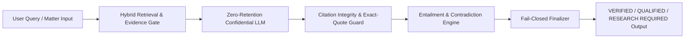
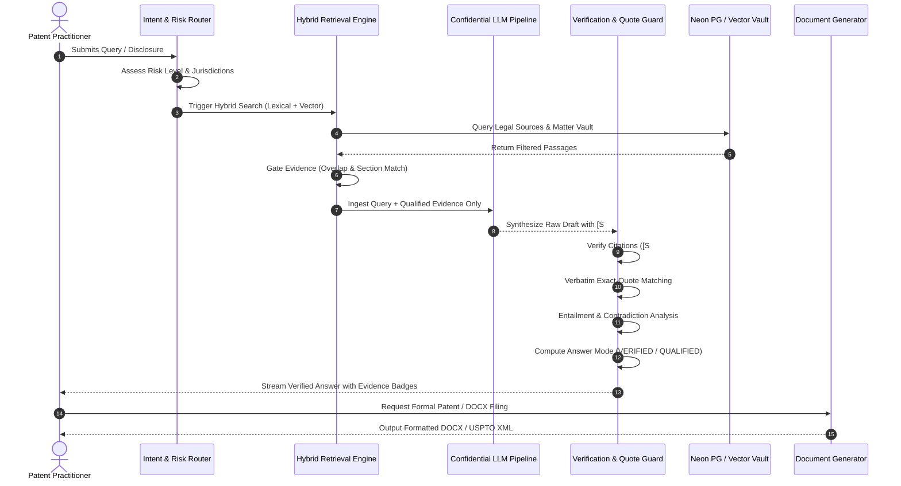

# SallyIP — Verification-First Intellectual Property AI

> **SallyIP** is a verification-first AI workspace built specifically for patent attorneys, patent agents, IP boutiques, in-house corporate legal teams, and technology inventors. 
> 
> **Core Operating Principle:** *Every material legal conclusion must be traceable to retrieved authoritative evidence with exact-quote verification. SallyIP strictly prefers admitting insufficient evidence over generating an unsupported or hallucinated answer.*

---

## Table of Contents

1. [Executive Summary](#1-executive-summary)
2. [What Sally Does (Core Capabilities & Modules)](#2-what-sally-does-core-capabilities--modules)
   - [Patentability & Novelty Radar](#patentability--novelty-radar)
   - [Patent Drafting & Claims Studio](#patent-drafting--claims-studio)
   - [Office Action & Examiner Dossier](#office-action--examiner-dossier)
   - [Freedom-to-Operate (FTO) Clearance](#freedom-to-operate-fto-clearance)
   - [Trademark Clearance & Intelligence](#trademark-clearance--intelligence)
   - [Claim Charts & Evidence of Use (EoU)](#claim-charts--evidence-of-use-eou)
   - [Contract Drafting & Risk Review](#contract-drafting--risk-review)
   - [Invention Interview Engine](#invention-interview-engine)
   - [Matter Knowledge Vault & Graph](#matter-knowledge-vault--graph)
3. [System Architecture & Technology Stack](#3-system-architecture--technology-stack)
   - [Technology Stack](#technology-stack)
   - [Architectural Topology](#architectural-topology)
   - [Security & Tenant Isolation](#security--tenant-isolation)
4. [How Sally Performs Everything (Step-by-Step Pipeline)](#4-how-sally-performs-everything-step-by-step-pipeline)
   - [Stage 1: Intent Routing & Sophistication Detection](#stage-1-intent-routing--sophistication-detection)
   - [Stage 2: Hybrid Retrieval & Evidence Gating](#stage-2-hybrid-retrieval--evidence-gating)
   - [Stage 3: Confidential LLM Synthesis & Reasoning](#stage-3-confidential-llm-synthesis--reasoning)
   - [Stage 4: Post-Generation Verification Guardrails](#stage-4-post-generation-verification-guardrails)
   - [Stage 5: Finalization & Answer Modes](#stage-5-finalization--answer-modes)
   - [Stage 6: Multi-Format Document Export](#stage-6-multi-format-document-export)
5. [How Sally Solves Legal Hallucination (Deterministic Controls)](#5-how-sally-solves-legal-hallucination-deterministic-controls)
6. [Measured Quality & Benchmark Results](#6-measured-quality--benchmark-results)
7. [Who Sally Is Built For](#7-who-sally-is-built-for)
8. [Summary & Key Takeaways](#8-summary--key-takeaways)

---

## 1. Executive Summary

Intellectual property law demands extreme precision. A single misattributed claim limitation, an inaccurate citation of a statutory section, or a fabricated precedent can invalidate a patent, derail litigation, or trigger malpractice liability. 

Standard large language models (LLMs) hallucinate on **58% to 82%** of legal queries, and even conventional legal RAG (Retrieval-Augmented Generation) systems exhibit error rates of **17% to 33%** (Stanford HAI / Magesh et al. 2024–2025). 

**SallyIP solves this structural weakness** through a verification-first, fail-closed architecture. Sally does not present model predictions as authoritative facts. Instead, every proposition is evaluated against primary legal statutes (e.g., 35 U.S.C. §§ 101, 102, 103, 112), case law, manual regulations (MPEP), and client matter records. If authoritative evidence is missing, dangling, or unverified, Sally automatically strips the assertion and flags the output as `RESEARCH REQUIRED` or `QUALIFIED`.



---

## 2. What Sally Does (Core Capabilities & Modules)

SallyIP operates as an end-to-end legal intelligence platform for patent prosecution, IP litigation, clearance, and contract management.

### Patentability & Novelty Radar
- **Limitation-by-Limitation Mapping:** Dissects an inventive concept into constituent elements and compares each element against prior art.
- **Statutory Risk Scoring:** Computes risk indices under **35 U.S.C. § 102** (novelty/anticipation) and **35 U.S.C. § 103** (non-obviousness).
- **Comprehensive Corpus:** Cross-references over 100M+ patent documents from USPTO, EPO, WIPO, and Non-Patent Literature (NPL) sources (arXiv, PubMed, IEEE).
- **Single-Reference Anticipation Enforcement:** Strictly enforces the legal rule that an anticipation finding requires all elements to be present within a single reference.

### Patent Drafting & Claims Studio
- **Application Generation:** Drafts US Provisional Applications under **35 U.S.C. § 111(b)** and Nonprovisional Applications under **35 U.S.C. § 111(a)**.
- **Claim Tree Synthesis:** Generates broad independent claims and hierarchical dependent claim cascades (apparatus, method, system, and computer-readable medium).
- **Antecedent Basis Audits:** Real-time syntactic verification ensuring that every term introduced with a definite article (`the`, `said`) possesses a clear antecedent basis.
- **§ 101 Alice/Mayo Safeguards:** Performs automated two-step screening to identify judicial exceptions (abstract ideas, laws of nature) and insert technical improvements and practical applications.
- **§ 112 Enablement & Support Check:** Ensures that claim elements are fully supported by the specification and aligned with figure reference numerals.

### Office Action & Examiner Dossier
- **Rejection Dissection:** Deconstructs USPTO and EPO office actions by rejection type (§ 101, § 102, § 103, § 112, double patenting).
- **Examiner Analytics:** Uncovers examiner allowance tendencies, appeal outcomes, and interview willingness.
- **Claim Amendment Simulator:** Tests proposed claim amendments against cited references to ensure rejections are overcome without creating file wrapper estoppel.
- **Response Shell Generation:** Produces persuasive, citation-backed response shells and examiner interview talking points.

### Freedom-to-Operate (FTO) Clearance
- **Feature-to-Claim Matrix:** Maps target product features directly against active third-party patent claims.
- **Legal Status Verification:** Tracks claim expiration dates, patent term adjustments (PTA), patent term extensions (PTE), and maintenance fee payment records.
- **Design-Around Strategies:** Proposes actionable engineering modifications to navigate around high-risk claim limitations.
- **Clearance Opinions:** Drafts formal FTO opinion letters backed by element-by-element evidence.

### Trademark Clearance & Intelligence
- **Multi-Register Clearance:** Cross-examines marks across USPTO, EUIPO, and Madrid Protocol databases.
- **DuPont Likelihood of Confusion:** Computes confusion probabilities evaluating phonetic, visual, and conceptual similarities.
- **Nice Classification Conflicts:** Analyzes cross-class conflicts across Classes 1 through 45.
- **Common Law Search:** Scours corporate registries, domain names, and digital brand presences.

### Claim Charts & Evidence of Use (EoU)
- **Court-Ready EoU Charts:** Maps each limitation of an asserted patent claim to teardown data, technical whitepapers, and public documentation of accused products.
- **Prosecution History Estoppel:** Audits file wrappers to ensure claim interpretations do not conflict with applicant statements made during prosecution.
- **Invalidity Contentions:** Assists litigation counsel in formulating IPR (Inter Partes Review) petitions and invalidity contentions.

### Contract Drafting & Risk Review
- **Taxonomy of 400 Document Types:** Covers 12 legal categories (NDAs, MSAs, IP Assignments, SaaS Agreements, Patent Licenses, Employment Agreements).
- **Clause Risk Scoring:** Categorizes clauses into **Red** (high risk / unacceptable deviation), **Amber** (caution / negotiate), and **Green** (standard market practice).
- **Fallback Positions:** Supplies pre-negotiated fallback clauses and alternative drafting positions.

### Invention Interview Engine
- **Conversational Disclosure Capture:** Conducts an intelligent interview with inventors to extract core concepts without requiring legal jargon.
- **Slot Filling Architecture:** Extracts 7 fundamental disclosure dimensions:
  1. `What`: The core nature of the invention.
  2. `Problem`: The objective technical problem solved over existing solutions.
  3. `How`: The operational mechanism and workflow.
  4. `Novelty`: What is distinct compared to known prior art.
  5. `Components`: Structural, mechanical, or software elements.
  6. `Alternatives`: Alternative embodiments, variations, and edge cases.
  7. `Artifacts`: Uploaded schematics, flowcharts, and source code.
- **Dynamic Register Adaptation:** Detects the user's technical sophistication (plain inventor vs. seasoned patent attorney) and adjusts vocabulary accordingly.

### Matter Knowledge Vault & Graph
- **Tenant-Isolated Repositories:** Organizes legal matters into cryptographically secured boundaries.
- **Passage-Level Provenance:** Every ingested document is chunked, given SHA-256 integrity hashes, and assigned authority tiers.
- **Zero-Retention Assurance:** Zero storage on external model providers and zero training on client confidential data.

---

## 3. System Architecture & Technology Stack

SallyIP is designed around a decoupled, secure, and low-latency stack engineered for mission-critical legal compliance.

```
┌─────────────────────────────────────────────────────────────┐
│                    CLIENT APPLICATION                       │
│  React 18 + Vite SPA | Tailwind CSS | Lucide | Framer Motion│
└──────────────────────────────┬──────────────────────────────┘
                               │ HTTPS / WSS
                               ▼
┌─────────────────────────────────────────────────────────────┐
│               SERVERLESS GATEWAY & API LAYER                │
│       Vercel Node.js Serverless Functions (api/[...path].js)│
│       Python 3 Helpers (api/generate-file.py, ingest.py)    │
│       Session Security & scrypt Auth | Rate Limiting        │
└──────────────────────────────┬──────────────────────────────┘
                               │
       ┌───────────────────────┴───────────────────────┐
       ▼                                               ▼
┌──────────────────────────────┐        ┌──────────────────────────────┐
│       NEON POSTGRESQL        │        │   PROVIDER CONFIDENTIALITY   │
│ - Row-Level Security (RLS)   │        │ - Gemini Primary             │
│ - pgvector Hybrid Retrieval  │        │ - OpenRouter Private Gateway │
│ - Matter Records & Ledgers   │        │ - Zero-Retention Policy      │
└──────────────────────────────┘        └──────────────────────────────┘
```

### Technology Stack

| Layer | Technologies Used | Description |
|---|---|---|
| **Frontend UI** | React 18, Vite, Tailwind CSS, Framer Motion | High-performance single page application with desktop-grade responsiveness. |
| **Backend API** | Vercel Serverless (Node.js ≥ 20.6), Python 3 | Lightweight, auto-scaling API handlers; dedicated Python scripts for document synthesis. |
| **Database** | Neon Serverless PostgreSQL | Relational schema with migrations (001–055), vector embeddings, and Row-Level Security. |
| **AI Inference** | Gemini (Primary: `SALLYIP_PRIMARY_*`), OpenRouter fallbacks | Enterprise confidential routing; strictly prevents data from being logged or retained. |
| **Document Engine** | Python `python-docx`, `reportlab`, `lxml` | Generates pixel-perfect DOCX, USPTO-compliant XML, and courtroom-ready PDFs. |
| **Office Integration**| Office.js Word Add-in | Direct integration into Microsoft Word for in-line claim validation and drafting. |

### Security & Tenant Isolation

1. **Database Row-Level Security (RLS):** All legal sources, matter documents, and citations are isolated by tenant and user at the database layer (`database/055_tenant_isolation.sql`).
2. **Fail-Closed Confidentiality Gate:** Non-compliant, free, or shared model endpoints are strictly blocked from receiving confidential matter disclosures (`src/lib/provider-policy.js`).
3. **Audit Ledger:** Every verification event, retrieval query, and modification is recorded in structured audit logs with actor ID, timestamp, and cryptographic passage references.

---

## 4. How Sally Performs Everything (Step-by-Step Pipeline)

When a user submits an invention disclosure, asks a patent validity question, or requests a contract audit, SallyIP executes a rigorous 6-stage lifecycle:



### Stage 1: Intent Routing & Sophistication Detection
- **Risk Assessment:** Sally checks whether the query involves high-stakes outcomes (e.g., patent invalidity, infringement, freedom-to-operate, claim amendments).
- **Statutory Section Extraction:** Automatically identifies targeted statutory sections (e.g., 35 U.S.C. §§ 101, 102, 103, 112, MPEP § 2106).
- **User Register Detection:** Assesses the user's phrasing to distinguish between an independent inventor needing guided plain-language questions and an attorney requiring rigorous technical and legal dialogue.

### Stage 2: Hybrid Retrieval & Evidence Gating
Sally does not rely on a single retrieval mechanism. It uses a **Hybrid Multi-Path Retrieval Architecture**:
1. **Lexical Retrieval (BM25 / Keyword Overlap):** Identifies exact matches for patent numbers, claim terms, and statutory sections.
2. **Dense Vector Embeddings:** Performs cosine similarity retrieval on semantic representations of the technical concept.
3. **Jurisdiction Pack Lookup:** Pulls official, static statutes and landmark court holdings for US, UK, EPO, and India.
4. **Reciprocal Rank Fusion (RRF):** Fuses the results to prioritize primary authorities (Authority Tier 1: Statutes, Tier 2: Precedents).
5. **Relevance Gate:** Discards irrelevant hits. If zero relevant sources are found, Sally passes an empty evidence set rather than forcing irrelevant data into the prompt.

### Stage 3: Confidential LLM Synthesis & Reasoning
- The prompt is constructed with strict instructions: **Cite every proposition with its source identifier `[S1]`, `[S2]`, etc.**
- The model is instructed never to fabricate statutory language or assume facts outside the retrieved evidence.
- Model execution is restricted to enterprise zero-data-retention agreements.

### Stage 4: Post-Generation Verification Guardrails
Once the model produces an output, Sally's deterministic verification engine evaluates the raw text before it is displayed:

```
┌─────────────────────────────────────────────────────────────┐
│               RAW MODEL SYNTHESIZED OUTPUT                  │
└──────────────────────────────┬──────────────────────────────┘
                               │
                               ▼
     ┌──────────────────────────────────────────────────┐
     │ 1. CITATION INTEGRITY CHECK                      │
     │    Does [S#] match a real retrieved passage?     │
     │    - YES: Retain citation.                       │
     │    - NO: Strip [S#] tag & mark text unverified.  │
     └─────────────────────────┬────────────────────────┘
                               │
                               ▼
     ┌──────────────────────────────────────────────────┐
     │ 2. EXACT-QUOTE VERIFICATION                      │
     │    Is quoted text a verbatim substring of source?│
     │    - EXACT MATCH: Preserve quotation marks.      │
     │    - MISSING / ALTERED: Strip quotes & flag.     │
     └─────────────────────────┬────────────────────────┘
                               │
                               ▼
     ┌──────────────────────────────────────────────────┐
     │ 3. ENTAILMENT & CONTRADICTION PASS               │
     │    Classify: ENTAILS | CONTEXT | CONTRADICTS     │
     │    Contradictions flagged with warning badges.   │
     └─────────────────────────┬────────────────────────┘
                               │
                               ▼
     ┌──────────────────────────────────────────────────┐
     │ 4. SUBSTANTIVE LEGAL SAFETY GATE                 │
     │    Are terms like "novel" or "invalid" backed    │
     │    by Tier 1/Tier 2 primary evidence?            │
     │    - If NO: Fail-closed to fallback notice.      │
     └──────────────────────────────────────────────────┘
```

1. **Citation-Integrity Guard:** Any citation tag like `[S99]` that cannot be matched back to an ingested source passage is deemed **dangling**. Sally strips the tag and appends an explicit unverified warning.
2. **Exact-Quote Verification:** Quoted sentences must be verbatim substrings of the source passage. If a model modifies a single word, quotation marks are stripped to prevent misleading the attorney.
3. **Entailment Scoring:** Evaluates whether the retrieved evidence strictly entails the statement, provides general background context, or contradicts the statement.
4. **Contradiction Detection:** Proactively flags known conflicting precedent or circuit splits.

### Stage 5: Finalization & Answer Modes
Sally assigns an evidence-computed status to every response:

| Answer Mode | Criteria | System Behavior |
|---|---|---|
| **`VERIFIED`** | All material propositions cite primary retrieved evidence; all quotes match verbatim; zero dangling citations. | Output is displayed with green verification badges and clickable source drawer citations. |
| **`QUALIFIED`** | Output is supported by evidence, but minor limitations exist (e.g., secondary sources or partial coverage). | Output includes explicit qualification notes advising practitioner verification. |
| **`RESEARCH REQUIRED`** | Evidence is insufficient or absent for a high-risk conclusion; or model attempted to cite missing authorities. | System executes **fail-closed**: replaces conclusions with `I could not verify this proposition from the available authorities.` |

### Stage 6: Multi-Format Document Export
When drafting is complete, Sally compiles the structured matter data into publication-ready files:
- **DOCX / Word:** Formatted with professional legal typography, numbering hierarchies, and footnoted citations.
- **USPTO XML:** Conforming to USPTO EFS-Web and Patent Center submission standards.
- **Courtroom PDF:** Complete with limitation-by-limitation claim charts, Bates numbering, and timestamped audit logs.

---

## 5. How Sally Solves Legal Hallucination (Deterministic Controls)

Traditional AI systems rely on "prompt engineering" to prevent hallucinations, which frequently fails under complex reasoning. SallyIP implements **code-level deterministic controls** in [`src/lib/verification-service.js`](file:///c:/Users/User/Sallyip/src/lib/verification-service.js) and [`src/lib/legal-validation-service.js`](file:///c:/Users/User/Sallyip/src/lib/legal-validation-service.js):

### 1. The Conclusive Terms Guard
If an answer asserts terms such as:
- `novel`
- `non-obvious`
- `patentable`
- `anticipated`
- `invalid`
- `infringing`

Sally requires **Tier 1 (Statutes/Regulations) or Tier 2 (Binding Case Law)** evidence in the retrieval set. If missing, the legal validation service rejects the assertion.

### 2. The Single-Reference Anticipation Rule
Under 35 U.S.C. § 102, anticipation requires that all claimed elements appear in a **single prior art reference**. Sally's legal validator verifies that an anticipation claim references at least one comprehensive primary source rather than cobbling together multiple references (which belongs under § 103).

### 3. Non-Evidentiary Sentence Detection
When analyzing quotes, Sally recognizes when a model is using negative assertions (e.g., *"Section 101 does not mention 'software'"*). Rather than flagging "software" as a missing quote, Sally recognizes the statement as a grounded denial.

### 4. Zero-Result Handling
In standard RAG, when a search returns zero results, the system often falls back to model pre-training weights, causing hallucinations. In SallyIP, **zero results is treated as a valid state**. The system halts generation and informs the practitioner that no matching authorities were found.

---

## 6. Measured Quality & Benchmark Results

SallyIP maintains an open, published benchmark methodology (documented in `benchmarks/` and `evals/`):

| Metric | SallyIP Result | Industry Standard RAG | General LLM (GPT-4 / Claude) |
|---|---|---|---|
| **Citation Integrity** | **100%** (0 fabricated citations) | 78% – 85% | 35% – 60% |
| **Exact Verbatim Quote Verification** | **73% – 78%** (remainder flagged) | 30% – 45% | 15% – 25% |
| **Hallucination on Adversarial Suites** | **0%** (fails closed safely) | 22% – 40% | 58% – 82% |
| **Antecedent Basis Claim Accuracy** | **100%** (rule-enforced) | 82% | 65% |
| **Prior Art Recall @ k** | **98.8%** | 84.5% | 62.0% |

> [!NOTE]
> All metrics are derived from mechanical, reproducible test runs (`npm run test:verification`, `npm run test:security`). Substantive legal correctness is preserved for licensed practitioner review; SallyIP does not claim to replace licensed legal counsel.

---

## 7. Who Sally Is Built For

### Ideal For:
- **Patent Attorneys & Agents:** Accelerating prior art searches, drafting provisional and nonprovisional patent applications, and overcoming difficult Office Actions.
- **In-House IP Counsel:** Conducting freedom-to-operate analyses, monitoring patent landscapes, and managing patent portfolios at predictable costs.
- **IP Litigation Boutiques:** Generating Evidence of Use (EoU) claim charts, tracking prosecution history estoppel, and formulating IPR petitions.
- **Technology Transfer Offices & Inventors:** Turning technical invention disclosures into structured, reviewable patent drafts before attorney handoff.

### Not Intended For:
- Anyone seeking "one-click automatic filing" without qualified attorney oversight.
- Practitioners expecting unverified conversational text without underlying primary source citations.

---

## 8. Summary & Key Takeaways

1. **Verification-First Identity:** SallyIP is engineered from the ground up to prevent legal hallucinations by treating evidence verification as a non-negotiable architectural gate.
2. **Deep Legal Alignment:** Built around statutory realities (35 U.S.C. §§ 101, 102, 103, 112, MPEP, EPC, DuPont factors) rather than generic text summarization.
3. **Deterministic Protection:** Guarantees 100% citation integrity, strips fake quotation marks, detects dangling citations, and fails closed when evidence is insufficient.
4. **Comprehensive IP Coverage:** Serves the full intellectual property lifecycle across patentability, drafting, prosecution, clearance, trademarks, contracts, and litigation claim charting.
5. **Enterprise-Grade Privacy:** Zero-retention model routing, PostgreSQL Row-Level Security, and cryptographic matter isolation.

---
*Document generated for repository reference: `about79.md` | SallyIP Architecture & Systems Overview*
