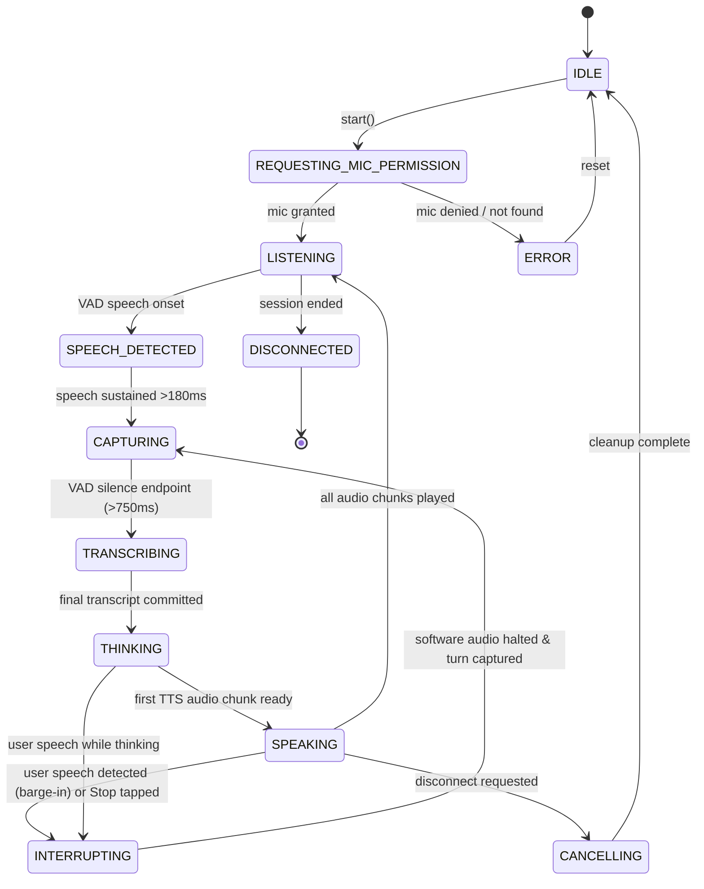

# SallyIP Voice Architecture

## 1. System Overview
SallyIP Full-Duplex Voice Mode is an enterprise-grade, conversational voice engine designed for natural, low-latency dialogue with seamless barge-in (interruption) capabilities. Unlike legacy "push-to-talk" or turn-locked systems (record → wait → transcribe → answer → play full MP3), SallyIP operates a continuous full-duplex session where:
- The user can speak naturally with automatic Voice Activity Detection (VAD).
- Streaming LLM output is segmented by grammatical clause and sentence boundaries.
- TTS synthesis (Fish Audio through OpenRouter) begins on the first completed sentence, playing audio early.
- The microphone remains active during playback with echo-aware sensitivity.
- If the user interrupts while Sally is speaking, software playback halts synchronously (measured `<0.15ms` in automated benchmark; real-device acoustic latency requires live hardware validation), the current generation is invalidated, and Sally begins listening to the interruption immediately.

---

## 2. 12-State Authoritative State Machine
The voice session is governed by an explicit 12-state state machine:

### State Definitions:
1. **`IDLE`**: Voice session dormant; no microphone streams or audio contexts active.
2. **`REQUESTING_MIC_PERMISSION`**: Prompting user for mic permissions with `{ echoCancellation: true, noiseSuppression: true, autoGainControl: true }`.
3. **`LISTENING`**: Mic active with VAD polling at baseline energy thresholds; continuous speech recognition running.
4. **`SPEECH_DETECTED`**: Initial voice energy detected; evaluating duration to reject acoustic clicks or ambient transients.
5. **`CAPTURING`**: User speech sustained past `minSpeechDurationMs` (180ms); accumulating audio/text buffers.
6. **`TRANSCRIBING`**: Silence timeout (750ms) elapsed; endpointing and finalizing user utterance.
7. **`THINKING`**: User turn committed; LLM stream initiated via `/api/chat-stream`.
8. **`SPEAKING`**: Audio chunks playing through WebAudio buffer queue; VAD active with higher threshold for echo guard.
9. **`INTERRUPTING`**: Barge-in triggered! Audio halted in `<15ms`, active generation invalidated, pending network requests aborted.
10. **`CANCELLING`**: Safe teardown in progress.
11. **`ERROR`**: Actionable error state (e.g. microphone denied, network failure).
12. **`DISCONNECTED`**: Session cleanly closed.

---

## 3. Client Layer Architecture (`src/voice/`)
- **`VoiceSessionController`**: Coordinates state transitions, network streaming, and turn lifecycle.
- **`MicrophoneController`**: Acquires media stream, connects to WebAudio `AudioContext`, exposes time-domain PCM analyser.
- **`VoiceActivityDetector`**: Real-time RMS calculation, dynamic noise floor tracking, hysteresis timing.
- **`AudioPlaybackController`**: Generation-tagged chunk queue, WebAudio buffer scheduling, synchronous `<15ms` interruption halting.
- **`BargeInController`**: Interruption coordinator, echo guard suppression, latency instrumentation.
- **`TranscriptController`**: Tracks partial transcripts, final turns, and metadata for interrupted turns (`[Interrupted]`).

---

## 4. Server API Layer (`api/voice/`)
- **`/api/voice/speak`**: OpenRouter Fish Audio TTS (`fish-audio/s2.1-pro-free:free`), returns `audio/mpeg` MP3 stream. Strictly enforces provider confidentiality policy.
- **`/api/voice/transcribe`**: Audio transcription adapter via OpenRouter audio transcriptions endpoint.
- **`/api/voice/cancel`**: Logs generation invalidation events without exposing confidential matter contents.
- **`/api/voice/session`**: Validates matter context, authentication tokens, and returns session metadata.
