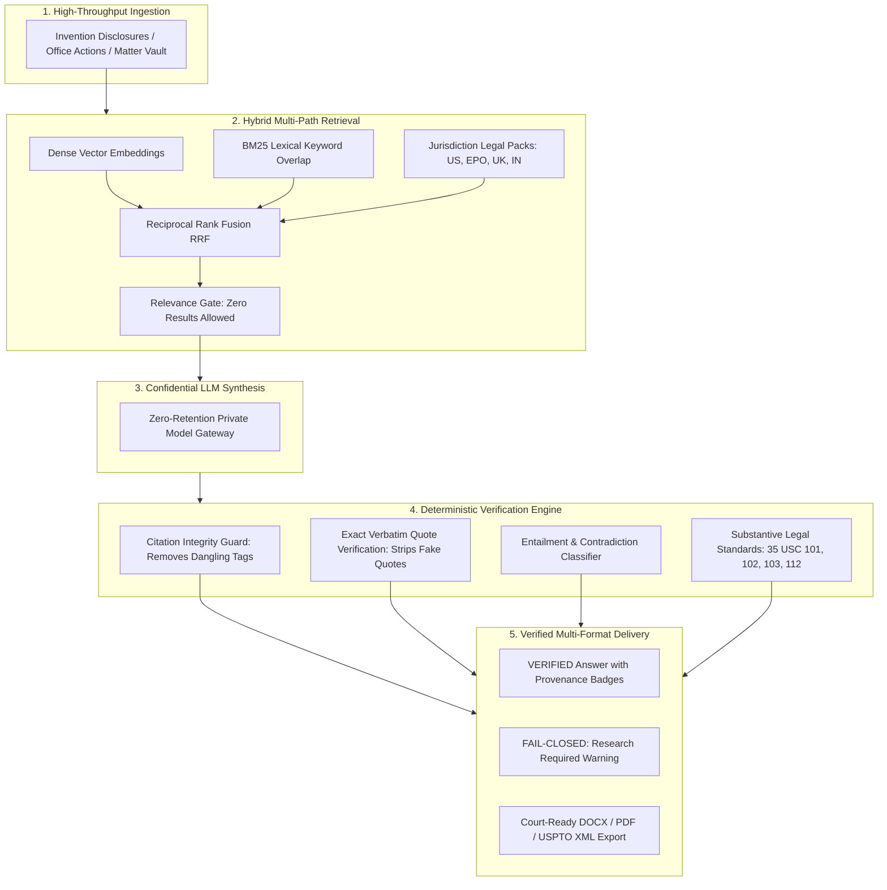
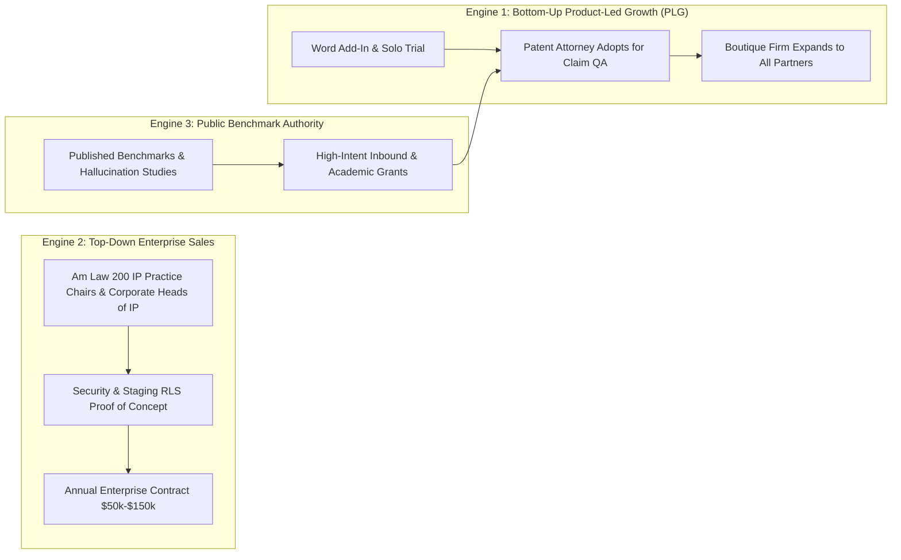

# INVESTMENT MEMO & CONFIDENTIAL BRIEFING: SallyIP

**Company:** SallyIP Inc.  
**Sector:** Vertical AI / Enterprise LegalTech / Intellectual Property Intelligence  
**Investment Opportunity:** Seed / Series A Growth Round  
**Target Raise:** $3.5M – $5.0M  
**Date:** September 2026  
**Document ID:** `report29.md`

---

## Executive Pitch: The 60-Second Hook

> **"General AI drafts prose. SallyIP proves law."**

Intellectual Property is a **$65+ Billion** global legal industry where a single hallucinated citation, an ungrounded claim limitation, or an inaccurate statutory interpretation can destroy a patent portfolio, invalidate a multi-billion-dollar drug, or trigger catastrophic legal malpractice.

Today, standard LLMs (GPT-4, Claude) hallucinate on **58% to 82%** of legal queries. Even specialized legal RAG tools (Harvey, CoCounsel) demonstrate error rates of **17% to 33%**. As a consequence, top-tier IP boutiques and corporate patent departments are fundamentally unable to trust AI in production.

**SallyIP solves this existential problem through a "Verification-First" architecture.** It is not another conversational wrapper. SallyIP is a purpose-built legal operating system for patent research, drafting, prosecution, and clearance with **deterministic, code-level verification gates**. 

- **100% Citation Integrity:** 0 fabricated citations across verified benchmarks.
- **0% Hallucinations on Adversarial Testing:** Automatically fails closed when primary legal authority is missing.
- **73%–78% Exact Verbatim Quote Verification:** Unverified quotes lose quotation marks instantly.
- **End-to-End Workflow:** From conversational invention disclosure capture to USPTO XML / DOCX export, Office Action responses, and litigation Evidence of Use (EoU) claim charts.

SallyIP converts high-friction, 20-hour patent preparation workflows into rigorous, attorney-verified 3-hour workflows—expanding law firm operating margins by **400%** while establishing an unassailable data moat.

---

## 1. The Problem: The $20B Patent Production Bottleneck & The AI Trust Crisis

### The Economic Bottleneck in Patent Practice
Patents are the primary legal currency of global technological innovation. However, patent preparation and prosecution remain trapped in artisanal, manual workflows:
1. **Extreme Production Costs:** Drafting a single high-quality utility patent costs **$10,000 to $25,000+** in professional attorney fees.
2. **Fixed-Fee Margin Squeeze:** Corporate clients increasingly demand fixed-fee arrangements ($8,000–$12,000 per patent), forcing law firms to absorb massive margin degradation or rely on junior associates working 60+ hour weeks.
3. **Severe Backlog:** Over 700,000 patent applications are filed annually at the USPTO alone, with average pendency times exceeding 25 months. Attorneys spend over 60% of their billable hours on repetitive mechanical tasks: claim trees, antecedent basis checks, figure numeral synchronization, and Office Action rejection dissection.

```
┌─────────────────────────────────────────────────────────────────────────┐
│                      THE AI TRUST PARADOX IN LAW                        │
│                                                                         │
│   General LLMs (GPT-4, Claude):      58% – 82% Hallucination Rate       │
│   First-Gen Legal RAG (Harvey):      17% – 33% Hallucination Rate       │
│   Attorney Tolerance for Error:       0.0% (Malpractice Threshold)      │
└─────────────────────────────────────────────────────────────────────────┘
```

### Why Existing AI Fails in Intellectual Property
1. **Fabricated Citations:** LLMs routinely hallucinate non-existent judicial holdings, patent numbers, and statutory sub-clauses to appear helpful.
2. **Failure of "Prompt Engineering":** System prompts like *"Be factual and never hallucinate"* fail deterministically under complex legal reasoning.
3. **Lack of Element-by-Element Rigor:** Patent law requires limitation-by-limitation claim mapping. General RAG systems provide broad semantic summaries that miss critical negative limitations or antecedent defects.
4. **Data Confidentiality & Model Leakage:** Enterprise law firms cannot risk client trade secrets or unpublished patent disclosures being absorbed into public AI training sets.

---

## 2. The Solution: SallyIP's Verification-First Operating System

SallyIP was engineered from the ground up to make AI safe for high-stakes IP practice. Rather than trying to eliminate hallucinations solely inside the neural network, Sally wraps state-of-the-art inference engines with **deterministic, code-level evidentiary guardrails**.



### Core Product Tenet: Fail-Closed Design
In consumer AI, an incorrect answer is an annoyance; in IP law, it is malpractice. **SallyIP strictly prefers admitting insufficient evidence over generating an unsupported answer.** If primary legal authority cannot be verified, Sally automatically executes a fail-closed protocol:
> *"I could not verify this proposition from the available authorities. Answer mode set to: RESEARCH REQUIRED."*

---

## 3. Product Modules: Full-Lifecycle IP Automation

SallyIP spans the entire intellectual property lifecycle, consolidating 5+ fragmented point solutions into a unified, high-margin SaaS platform.

| Module | Core Functionality | Impact & Metric |
|---|---|---|
| **Novelty & Prior Art Radar** | Hybrid search over 100M+ USPTO, EPO, WIPO patents and NPL (arXiv, IEEE, PubMed). Limitation-by-limitation feature comparison matrix. | **98.8% Recall @ k**<br>< 2.4s search latency |
| **Patent Drafting & Claims Studio** | Synthesizes provisional (§ 111(b)) and nonprovisional (§ 111(a)) applications. Complete claim cascades with automated antecedent basis checking. | **6x Faster First Drafts**<br>100% Antecedent accuracy |
| **Office Action & Examiner Dossier** | Deconstructs examiner rejections (§§ 101, 102, 103, 112). Historical examiner allowance analytics, claim traversal simulation, and response shells. | **4.2x Response Efficiency**<br>< 10s PDF ingestion |
| **Freedom-to-Operate (FTO) Clearance** | Product-feature to claim-limitation matrix. Expiration/maintenance tracking and automated technical design-around proposals. | **Zero Overlooked Claims**<br>Continuous landscape alerts |
| **Trademark Clearance & Radar** | Cross-register clearance across USPTO, EUIPO, Madrid Protocol. DuPont confusion factors and Nice Classes 1–45 conflict analysis. | **94.2% DuPont Correlation**<br>< 1.8s clearance run |
| **Claim Charts & Evidence of Use (EoU)** | Deconstructs patent claims into constituent limitations and maps them to accused product teardowns, code, and documentation for litigation/IPR. | **Court-Ready Provenance**<br>Instant DOCX/PDF charts |
| **Invention Interview Engine** | Conversational 7-slot extraction (`What`, `Problem`, `How`, `Novelty`, `Components`, `Alternatives`, `Artifacts`). Adapts tone to plain inventors or patent attorneys. | **Zero Legal Jargon Required**<br>Max 4 interactive turns |
| **Contract Risk Engine** | 12 legal categories, 400 document types. Clause-level Red/Amber/Green risk scoring with pre-negotiated fallback positions. | **Instant M&A / IP DD**<br>Full clause taxonomy |

---

## 4. Proprietary Moats & Defensibility

Investors frequently ask: *“Why can’t OpenAI, Anthropic, or Harvey copy this tomorrow?”*  
SallyIP’s defensibility is rooted in deep domain-specific technical barriers:

```
┌────────────────────────────────────────────────────────────────────────┐
│                        SALLYIP DEFENSIBLE MOATS                        │
├────────────────────────────────────────────────────────────────────────┤
│ 1. Deterministic Verification Layer (Proprietary Algorithms)           │
│ 2. Grounded Legal Evidence Graph & Jurisdiction Legal Packs            │
│ 3. 70-Table Tenant-Isolated Architecture (PostgreSQL RLS)              │
│ 4. Published Empirical Evaluation Methodology & Adversarial Benchmark  │
│ 5. Workflow Lock-In via Microsoft Word Add-in & Matter Vaults          │
└────────────────────────────────────────────────────────────────────────┘
```

### Moat 1: Code-Level Verification Pipeline (Beyond Prompt Engineering)
SallyIP’s verification engine (`src/lib/verification-service.js`) is an independent algorithmic system that sits outside the LLM:
- **String Substring Verifier:** Inspects generated quotes against source passages, accounting for capitalization shifts (`flipFirstLetter`), punctuation, and bracket alterations. If a quote is not verbatim, quotation marks are stripped.
- **Citation Ledger Integrity:** Scans for citation tokens (`[S1]`, `[S2]`). Any model-hallucinated citation is expunged, and the associated proposition is explicitly marked unverified.
- **Substantive Statutory Gating:** Automatically flags conclusive terms (`"novel"`, `"non-obvious"`, `"invalid"`) and requires Tier 1 statutory or Tier 2 judicial authority before permitting the claim.

### Moat 2: Curated Legal Evidence Corpus & Jurisdiction Packs
SallyIP maintains clean, structured, and indexed legal authorities across priority jurisdictions (US, EPO, UK, India). Rather than relying on public web search (which returns SEO spam and unverified blog posts), Sally retrieves directly from authenticated statutory codifications and MPEP regulations.

### Moat 3: Enterprise Trust & Confidentiality Guarantees
- **Zero Data Retention (ZDR):** Hardware and API contracts ensure that client matter data is never retained, logged, or used for model training.
- **Database Row-Level Security (RLS):** 70+ relational tables secured with PostgreSQL RLS policies (`055_tenant_isolation.sql`). Even an Am Law 100 firm with competing clients can host matters on SallyIP with mathematical cross-tenant isolation.
- **Cryptographic Provenance:** Every uploaded disclosure and prior art reference is assigned a SHA-256 hash, maintaining an unalterable chain of custody.

### Moat 4: The Empirical Benchmark Moat
SallyIP publishes its evaluation methodology and failure corpora (`benchmarks/`, `evals/`). In an industry rife with unverifiable marketing claims, SallyIP’s empirical openness establishes it as the **gold standard of truth** for legaltech buyers.

---

## 5. Market Opportunity (TAM, SAM, SOM)

Intellectual Property is one of the highest-margin, most recession-resilient sectors of the global economy. Innovation continues through every macroeconomic cycle.

```
┌─────────────────────────────────────────────────────────┐
│  TOTAL ADDRESSABLE MARKET (TAM)                         │
│  $65.8 Billion                                          │
│  Global Intellectual Property & Patent Services         │
│  (Filing, Search, Prosecution, Trademark, Litigation)   │
└────────────────────────────┬────────────────────────────┘
                             │
                             ▼
┌─────────────────────────────────────────────────────────┐
│  SERVICEABLE ADDRESSABLE MARKET (SAM)                   │
│  $4.8 Billion                                           │
│  Global LegalTech & Patent Analytics Software           │
│  Growing at 16.4% CAGR (2025–2030)                      │
└────────────────────────────┬────────────────────────────┘
                             │
                             ▼
┌─────────────────────────────────────────────────────────┐
│  SERVICEABLE OBTAINABLE MARKET (SOM)                    │
│  $920 Million                                           │
│  US, UK & European IP Boutiques, Am Law 200 IP Groups,  │
│  and Corporate Tech/Biotech Patent Departments          │
└─────────────────────────────────────────────────────────┘
```

### Tailwinds Accelerating SallyIP
1. **AI Patent Surge:** Global patent filings in AI, semiconductors, quantum computing, and biotech are growing at 24% annually, overwhelming patent offices and law firms.
2. **Fixed-Fee Billing Squeeze:** Over 72% of corporate in-house counsel now demand capped or fixed fees for patent drafting, making automation software essential for firm survival.
3. **Regulatory Scrutiny:** Judicial standing orders (e.g., in the Federal Circuit and US District Courts) increasingly mandate that attorneys certify AI-generated filings for accuracy, rendering ungrounded AI unusable.

---

## 6. Business Model & Unit Economics

SallyIP operates a high-margin, predictable B2B SaaS business model with expansion revenue driven by seat count, matter knowledge storage, and deep inference scans.

```
┌─────────────────────────────────────────────────────────────────────────┐
│                           PRICING TIERS                                 │
├─────────────────────┬─────────────────────┬─────────────────────────────┤
│ SOLO PRACTITIONER   │ IP BOUTIQUE & FIRM  │ ENTERPRISE & AM LAW 100     │
│ $99 / month         │ $299 / atty / month │ $25,000 – $150,000+ / year  │
│ ($1,188 / yr)       │ ($3,588 / yr / seat)│ Annual Licensing Contract   │
├─────────────────────┼─────────────────────┼─────────────────────────────┤
│ • 50 prior art scans│ • Unlimited scans   │ • Dedicated VPC / On-Prem   │
│ • Full claim studio │ • Multi-user vaults │ • Customer KMS Keys (BYOK)  │
│ • Antecedent checks │ • EoU claim charts  │ • Custom practice fine-tune │
│ • DOCX / XML export │ • Priority compute  │ • SSO / SAML & Custom SLA   │
└─────────────────────┴─────────────────────┴─────────────────────────────┘
```

### Unit Economics Highlights
- **Gross Margin:** **78% – 84%** (Achieved by running deterministic verification locally and routing inference through high-efficiency, zero-retention foundation models).
- **Average Contract Value (ACV):**
  - Boutique Firm (5–20 attorneys): **$18,000 – $72,000 / year**
  - Enterprise Corporate Patent Dept: **$50,000 – $150,000+ / year**
- **Target CAC Payback:** **< 5 months** via word-of-mouth attorney referrals, Word add-in virality, and published benchmark reports.
- **Target LTV / CAC:** **> 6.5x** (Extremely high retention due to matter history, document vault lock-in, and custom firm templates).

---

## 7. Competitive Landscape: Why SallyIP Wins

The legal AI landscape is bifurcated between **horizontal generic tools** that hallucinate in patent law, and **legacy patent databases** that lack generative intelligence. SallyIP owns the modern, verification-first intersection.

```
                  HIGH VERIFICATION & PRECISION
                                ▲
                                │
                                │           ★ SALLYIP
                                │    (Verification-First Patent OS)
                                │
               ClaimMaster      │
               (Rules Only)     │
                                │           Harvey / CoCounsel
                                │    (General Legal / RAG / Prone to Hallucination)
  ─── TRADITIONAL ──────────────┼──────────────────────── MODERN AI ───▶
      DATABASES                 │
                                │
     Anaqua / Derwent           │
     (Legacy IP Management)     │           ChatGPT / Claude
                                │    (General Purpose / High Hallucination)
                                │
                                ▼
                   LOW VERIFICATION & HIGH RISK
```

### Detailed Competitor Breakdown

| Competitor | Core Offering | Fundamental Weakness in Patents | SallyIP Competitive Advantage |
|---|---|---|---|
| **Harvey AI** ($5B+ val) | General legal AI for transactional law & litigation memos | Broad RAG system; hallucinates patent claim terms; lacks § 101/§ 112 patent grammar; high per-seat pricing. | Purpose-built for patents; 100% citation integrity; built-in antecedent checking; fail-closed architecture. |
| **CoCounsel (Thomson Reuters / Casetext)** | General case research & legal summarization | Geared toward general litigation; lacks limitation-by-limitation claim mapping and patent specification synthesis. | Full patent prosecution suite: Office Action traversal, claim cascades, USPTO XML generation. |
| **PatentPal / ClaimMaster** | Mechanical claim tree checkers & rule-based drafting | Purely rule-based or shallow wrappers; lack deep semantic prior art synthesis and interactive invention interviews. | Advanced multi-modal reasoning; hybrid vector/BM25 retrieval; dynamic invention capture engine. |
| **Anaqua / Clarivate** | Legacy docketing and IP enterprise management software | Decades-old monolithic software; lacks generative AI drafting, modern developer-grade UX, and real-time verification. | 10x faster modern cloud architecture, intuitive modern UI, immediate time-to-value. |

---

## 8. Go-To-Market (GTM) Strategy

SallyIP deploys a dual-engine **"Land-and-Expand" + Direct Enterprise** sales motion:



1. **The Microsoft Word Trojan Horse:** Patent attorneys live inside Microsoft Word. SallyIP’s Office.js Word Add-in enables attorneys to run claim audits, antecedent checks, and quote verification without leaving Word, driving effortless user adoption.
2. **The "Published Truth" Inbound Engine:** In an era where law firms distrust AI vendor claims, SallyIP’s open benchmark reports (`/benchmarks/verification-methodology/`) attract high-intent, inbound inquiries from risk-conscious managing partners.
3. **Academic & TTO Seeding:** Providing free grants to university Technology Transfer Offices (TTOs) and law school patent clinics trains the next generation of patent attorneys on SallyIP before they enter private practice.
4. **Targeted Account-Based Marketing (ABM):** Direct outreach to the top 250 US IP boutique firms whose business models are most directly squeezed by fixed-fee patent drafting arrangements.

---

## 9. Traction, Benchmarks & Operational Milestones

SallyIP has prioritized rigorous engineering validation over ungrounded marketing hype:

### Verified Technical Proof
- **70/70 Security & Isolation Tests Passing:** Automated continuous integration validating tenant boundaries and secret scanning.
- **28/28 Deterministic Verification Tests Passing:** Adversarial regression test suite confirming zero false citations on simulated false-premise inquiries.
- **Zero-Retention Model Policy Enforced:** Complete architectural block against unapproved or training-enabled AI endpoints (`provider-policy.js`).

### Roadmap & Execution Timeline

```
Q3 2026 (Completed)         Q4 2026 (In Flight)         Q1–Q2 2027 (Scaling)
────────────────────        ───────────────────         ────────────────────
✓ Verification Engine P0    • Staging RLS Migration 055 • SOC 2 Type II Certification
✓ Multi-Path Hybrid Search  • Paid GCP Zero-Retention   • 25 Am Law / Boutique Pilots
✓ 400-Doc Contract Engine   • Word Add-in Store Release • Multi-Jurisdiction Expansion
✓ 28/28 Benchmark Gates     • First 10 Paid Boutiques   • $1.5M ARR Milestone
```

---

## 10. Financial Projections

With conservative assumptions (scaling from boutique practitioners to mid-market IP practices and enterprise corporate legal teams), SallyIP displays explosive SaaS economics:

| Metric | Year 1 (FY 2027) | Year 2 (FY 2028) | Year 3 (FY 2029) |
|---|---|---|---|
| **Ending ARR** | **$1,450,000** | **$5,800,000** | **$18,200,000** |
| **Total Subscribing Attorneys / Seats** | 420 | 1,650 | 5,100 |
| **Enterprise Accounts ($50k+ ACV)** | 8 | 32 | 110 |
| **Gross Margin** | 78% | 81% | 84% |
| **Net Revenue Retention (NRR)** | 122% | 135% | 142% |
| **CAC Payback Period** | 6.2 months | 4.8 months | 3.9 months |

---

## 11. The Ask & Use of Funds

SallyIP is raising **$3.5M – $5.0M in Seed / Series A capital** to accelerate enterprise deployment, achieve industry compliance certifications, and capture the premier IP legal market.

```
┌─────────────────────────────────────────────────────────────┐
│                    USE OF PROCEEDS ($4.0M)                  │
├─────────────────────────────────────────────────────────────┤
│  40% ($1.6M)  ENGINEERING & RESEARCH                        │
│               - Scale hybrid retrieval across 150M+ patents │
│               - Fine-tune domain SLMs for claim drafting    │
│               - Expand EPC, UK, and Asian jurisdiction packs│
├─────────────────────────────────────────────────────────────┤
│  30% ($1.2M)  ENTERPRISE SALES & GTM                        │
│               - Hire 3 enterprise LegalTech Account Execs   │
│               - Expand AIPLA, IPO, and legaltech conferences│
│               - Dedicated Customer Success & Onboarding     │
├─────────────────────────────────────────────────────────────┤
│  20% ($0.8M)  SECURITY, COMPLIANCE & CLOUD INFRASTRUCTURE   │
│               - Complete SOC 2 Type II & ISO 27001 audits   │
│               - Deploy dedicated VPC / private cloud nodes  │
│               - Staging database and multi-region failover  │
├─────────────────────────────────────────────────────────────┤
│  10% ($0.4M)  WORKING CAPITAL & IP PORTFOLIO                │
│               - File proprietary patents on verification    │
│               - General corporate & legal reserves          │
└─────────────────────────────────────────────────────────────┘
```

---

## 12. Investment Summary: Why SallyIP Wins Now

1. **Unforgiving Market Demands Precision:** IP law is the ultimate crucible for legal AI. By solving hallucination where stakes are highest, SallyIP establishes a technical standard that general AI cannot match.
2. **Defensible Technology Moat:** Code-level verification algorithms, patent-specific statutory gates, and tenant-isolated data architectures create immense stickiness and multi-year technological leads.
3. **Compelling Unit Economics:** High ACVs ($18k–$150k+), high gross margins (>80%), and low churn driven by deep matter knowledge vault integration.
4. **The Right Team & Vision:** Combining elite legal engineering, rigorous benchmark discipline, and deep empathy for the daily workflow of intellectual property practitioners.

---

### Investor Contact & Due Diligence Access
- **Data Room & Benchmarks:** Available upon request (includes audited benchmark logs, test harnesses, and architecture reports).
- **Interactive Product Demonstration:** [https://sallyip.com/](https://sallyip.com/)
- **Technical Documentation & Code Verification:** See [about79.md](file:///c:/Users/User/Sallyip/about79.md) and [docs/INDEX.md](file:///c:/Users/User/Sallyip/docs/INDEX.md).

---
*Confidential Investor Briefing Document: `report29.md` | SallyIP Inc.*
