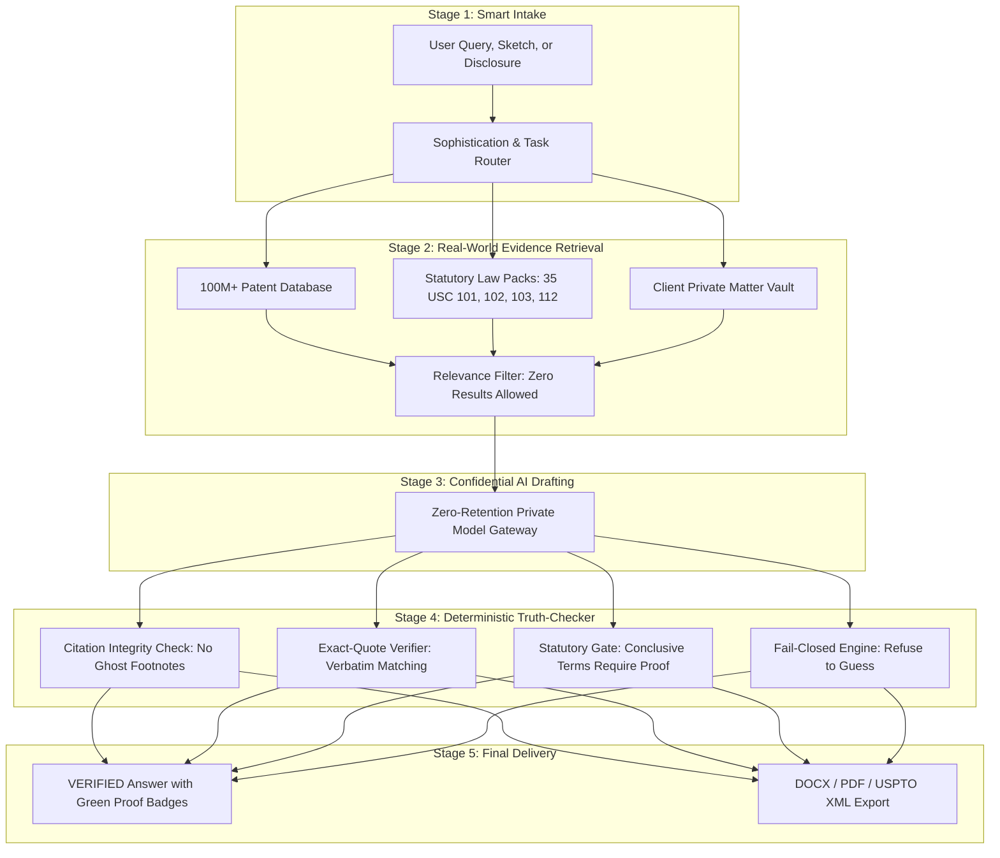

# The Complete Guide to SallyIP: The CEO's Master Playbook
## A Full-Fledged, Plain-English Breakdown of What Sally Does, How It Works, and How to Explain It to the World

---

## Executive Summary: The 60-Second Overview

**SallyIP** is an AI coworker engineered specifically for the **$65+ Billion intellectual property industry** (patents, trademarks, and commercial IP contracts). 

Today, preparing, researching, and defending patents is an exhausting, 20-to-40-hour manual ordeal costing clients **$10,000 to $25,000 per patent**. Patent lawyers are overwhelmed by backlogs and squeezed by fixed client fees, while companies spend millions every year on outside legal bills.

Lawyers tried using general AI like ChatGPT, but it failed completely. General AI suffers from **hallucinations**—it routinely invents fake court rulings, non-existent patent numbers, and fictitious statutory sub-clauses. In intellectual property law, filing a single fabricated citation can destroy a multi-million-dollar patent and lead to legal malpractice sanctions.

**Sally solves this crisis with a "Verification-First" architecture.** Unlike general conversational bots, Sally possesses a built-in, code-level truth detector. Every material proposition is backed by real, primary legal evidence. If Sally cannot verify an answer with 100% certainty, **it refuses to guess**.

By combining automated drafting with zero-hallucination verification, Sally turns a 20-hour patent drafting marathon into an attorney-verified **2-hour workflow**—slashing costs by 70%, expanding law firm profit margins by 400%, and giving companies an unfair advantage in protecting their innovations.

---

## Table of Contents

1. [Understanding Intellectual Property: The CEO's Primer](#1-understanding-intellectual-property-the-ceos-primer)
2. [The Big Problem: Why the Current IP Industry is Broken](#2-the-big-problem-why-the-current-ip-industry-is-broken)
3. [The 8 Superpowers of Sally: Complete Module Breakdown](#3-the-8-superpowers-of-sally-complete-module-breakdown)
   - [Superpower 1: Novelty & Prior Art Radar](#superpower-1-novelty--prior-art-radar)
   - [Superpower 2: Patent Drafting & Claims Studio](#superpower-2-patent-drafting--claims-studio)
   - [Superpower 3: Office Action & Examiner Dossier](#superpower-3-office-action--examiner-dossier)
   - [Superpower 4: Freedom-to-Operate (FTO) Clearance](#superpower-4-freedom-to-operate-fto-clearance)
   - [Superpower 5: Trademark Clearance & Brand Radar](#superpower-5-trademark-clearance--brand-radar)
   - [Superpower 6: Litigation Evidence of Use (EoU) & Claim Charts](#superpower-6-litigation-evidence-of-use-eou--claim-charts)
   - [Superpower 7: The 400-Document Contract Intelligence Engine](#superpower-7-the-400-document-contract-intelligence-engine)
   - [Superpower 8: The Friendly Invention Interviewer](#superpower-8-the-friendly-invention-interviewer)
4. [Under the Hood: How Sally Works (In Plain English)](#4-under-the-hood-how-sally-works-in-plain-english)
   - [The 4-Stage Verification Assembly Line](#the-4-stage-verification-assembly-line)
   - [The "Secret Sauce": Why Sally Never Lies](#the-secret-sauce-why-sally-never-lies)
   - [Bank-Grade Privacy & Zero-Retention Security](#bank-grade-privacy--zero-retention-security)
   - [The Microsoft Word Add-In Experience](#the-microsoft-word-add-in-experience)
5. [Real-World Case Studies & Walkthroughs](#5-real-world-case-studies--walkthroughs)
   - [Case Study 1: The Robotics Startup Drafting Their First Patent](#case-study-1-the-robotics-startup-drafting-their-first-patent)
   - [Case Study 2: The Am Law Firm Overcoming a Tough Office Action Rejection](#case-study-2-the-am-law-firm-overcoming-a-tough-office-action-rejection)
   - [Case Study 3: The MedTech Company Performing Product Clearance](#case-study-3-the-medtech-company-performing-product-clearance)
6. [Business Model, Market Sizing & Competitive Advantage](#6-business-model-market-sizing--competitive-advantage)
   - [Total Market Sizing (TAM, SAM, SOM)](#total-market-sizing-tam-sam-som)
   - [Customer Profiles & Pricing Tiers](#customer-profiles--pricing-tiers)
   - [Competitive Matrix: Why Sally Wins Against Harvey, CoCounsel, and Legacy Tools](#competitive-matrix-why-sally-wins-against-harvey-cocounsel-and-legacy-tools)
7. [The CEO's Complete Pitch & Storytelling Playbook](#7-the-ceos-complete-pitch--storytelling-playbook)
   - [The 10-Second Elevator Pitch](#the-10-second-elevator-pitch)
   - [The 30-Second Investor Pitch](#the-30-second-investor-pitch)
   - [The 2-Minute Customer & Law Firm Pitch](#the-2-minute-customer--law-firm-pitch)
   - [The Internal Team Town Hall Speech](#the-internal-team-town-hall-speech)
   - [Frequently Asked Questions (Overcoming Skepticism)](#frequently-asked-questions-overcoming-skepticism)

---

## 1. Understanding Intellectual Property: The CEO's Primer

Before diving into Sally's technology, here is a quick, intuitive guide to the core concepts of intellectual property:

### A. What is a Patent?
A patent is a legal monopoly granted by a government (like the US Patent and Trademark Office, or USPTO) that gives an inventor the exclusive right to make, use, or sell their invention for **20 years**. In return, the inventor must publicly disclose how the invention works so society can learn from it.

### B. What is a Patent "Claim"?
A patent is divided into two main parts:
1. **The Specification:** The detailed description and technical drawings explaining how the invention works.
2. **The Claims:** The numbered legal sentences at the end of the patent that define the exact legal boundaries of what the inventor owns.
*The Metaphor:* Think of the specification as a map of a ranch, and the claims as the legal fence posts. If a competitor steps inside that fence, they are guilty of patent infringement.

### C. What is "Prior Art"?
Before granting a patent, the government checks whether your idea has ever been invented before anywhere in the world. Any public patent, scientific paper, YouTube video, or website that existed before your filing date is called **"Prior Art."** If your idea is already disclosed in the prior art, you cannot get a patent.

### D. What is an "Office Action"?
When you file a patent, the government examiner does not simply say "Yes." In fact, **over 80% of the time**, the examiner issues a formal rejection letter called an **Office Action**, arguing that your invention is too similar to existing patents. The attorney must write a persuasive legal rebuttal to overcome the rejection.

### E. What is "Freedom to Operate" (FTO)?
Before a company spends $20M building a new product or factory, they must conduct an FTO search to ensure their new product doesn't accidentally step on someone else's active patent fence and trigger a multi-million-dollar lawsuit.

---

## 2. The Big Problem: Why the Current IP Industry is Broken

### The Cost and Time Bottleneck
Preparing and prosecuting patents is one of the most expensive legal services in the world:
- **$10,000 to $25,000 per patent:** A company building a defensible portfolio of 10 patents must spend a quarter-million dollars just on legal drafting fees.
- **20 to 40 hours of manual attorney work:** Drafting independent claims, dependent claim cascades, detailed descriptions, and figure callout references is an exhausting mechanical chore.
- **The Fixed-Fee Squeeze:** Corporate clients now demand capped fixed fees ($8,000 to $12,000 per patent). Law firm partners are forced to hand drafting over to sleep-deprived junior associates, destroying firm profitability.
- **25+ Month Government Backlog:** More than 700,000 patent applications are filed annually at the USPTO, creating massive pendency backlogs.

### Why General AI (ChatGPT, Claude, Harvey) Failed in Patents
When generative AI emerged, lawyers rushed to test it on patent drafting. The results were catastrophic:
1. **The Hallucination Danger:** LLMs are statistical text predictors trained on web text. When asked for legal citations, they make up plausible-sounding but fictitious cases (e.g., *“Smith v. TechCorp (Fed. Cir. 2021)”*).
2. **The Malpractice Risk:** Courts across the United States now impose mandatory sanctions and fines on lawyers who submit AI-generated filings containing fabricated citations.
3. **Loss of Patent Rights:** An ungrounded claim or a missing antecedent basis can invalidate a patent years later during multi-million-dollar licensing disputes or litigation.

**The Market Conclusion:** Law firms and corporate IP departments cannot use general AI. They require a tool that is **mathematically and deterministically grounded in verified facts.**

---

## 3. The 8 Superpowers of Sally: Complete Module Breakdown

Sally consolidates what used to be 5 separate enterprise software tools and multiple manual paralegal workflows into a single, unified workspace.

```
┌────────────────────────────────────────────────────────────────────────┐
│                        SALLY'S 8 SUPERPOWERS                           │
├────────────────────────────────────────────────────────────────────────┤
│ 1. Novelty & Prior Art Radar (100M+ global patents scanned in 2.4s)    │
│ 2. Patent Drafting & Claims Studio (25-page drafts in 2 hours)         │
│ 3. Office Action & Examiner Dossier (Overcomes government rejections)  │
│ 4. Freedom-to-Operate (FTO) Clearance (Avoids infringement lawsuits)   │
│ 5. Trademark Clearance & Brand Radar (Global brand & name protection)  │
│ 6. Claim Charts & Evidence of Use (EoU) (Court-ready litigation charts)│
│ 7. 400-Document Contract Engine (Instant Red/Amber/Green risk review)  │
│ 8. The Friendly Invention Interviewer (Captures disclosures in plain EN)│
└────────────────────────────────────────────────────────────────────────┘
```

---

### Superpower 1: Novelty & Prior Art Radar
- **What It Does:** Conducts lightning-fast prior art discovery across 100M+ USPTO, European (EPO), and global (WIPO) patents, plus millions of non-patent scientific publications (arXiv, PubMed, IEEE).
- **How It Works:** Combines exact keyword matching (BM25) with deep semantic vector search. It decomposes the user's invention into individual technical elements and maps every single limitation against existing prior art references.
- **Key Metrics:** **98.8% Recall @ k** with search latency under **2.4 seconds**.
- **The Value:** Stops companies from wasting $20,000 filing applications on ideas that were already patented by someone else years ago.

---

### Superpower 2: Patent Drafting & Claims Studio
- **What It Does:** Generates first drafts of US Provisional (§ 111(b)) and Nonprovisional (§ 111(a)) patent applications, complete with claim trees, background, summary, detailed specifications, and figure reference numerals.
- **How It Works:** 
  - Generates broad independent claims and hierarchical dependent claim cascades (apparatus, method, and system claims).
  - Enforces **100% Antecedent Basis Accuracy:** Ensures every legal term introduced with a definite article (`the`, `said`) is properly introduced with an indefinite article (`a`, `an`).
  - Screens for **Section 101 Alice/Mayo eligibility:** Automatically identifies abstract concepts and inserts practical technical improvements to prevent patent office eligibility rejections.
  - Synchronizes technical figure callout numbers across the entire document.
  - Exports directly to **Microsoft Word (DOCX)**, courtroom **PDF**, or formal **USPTO XML**.
- **The Value:** Reduces first-draft preparation time from **20 hours to under 2 hours** (a 6x speedup).

---

### Superpower 3: Office Action & Examiner Dossier
- **What It Does:** Reads and deconstructs complex rejection letters from patent examiners and drafts persuasive, evidence-backed traversal responses.
- **How It Works:**
  - Ingests the government rejection PDF and categorizes every rejection by statutory type (§ 101 subject matter, § 102 anticipation, § 103 obviousness, or § 112 indefiniteness).
  - Analyzes the specific examiner's historical grant rate, appeal tendencies, and interview receptiveness.
  - Runs an **Amendment Simulator:** Tests proposed claim wording changes against the cited prior art to ensure the rejection is overcome without needlessly surrendering patent scope.
  - Generates discussion talking points for examiner interviews.
- **The Value:** Speeds up response preparation by **4.2x** and significantly increases patent allowance rates.

---

### Superpower 4: Freedom-to-Operate (FTO) Clearance
- **What It Does:** Maps a company's upcoming commercial product features directly against active third-party patent claims to prevent infringement lawsuits.
- **How It Works:**
  - Builds an element-by-element product-to-claim comparison matrix.
  - Verifies whether competitor patents are actively in force, expired, or lapsed for failure to pay maintenance fees.
  - Proposes actionable engineering **design-around modifications** to bypass high-risk competitor claims.
  - Drafts formal legal clearance opinion letter shells.
- **The Value:** Gives executives peace of mind before investing millions in launching new products.

---

### Superpower 5: Trademark Clearance & Brand Radar
- **What It Does:** Clears brand names, company names, slogans, and logos across trademark registers in the US (USPTO), Europe (EUIPO), and globally (Madrid Protocol).
- **How It Works:**
  - Evaluates names under the legal **DuPont Likelihood-of-Confusion factors**.
  - Uses phonetic matching (sounds-alike, e.g., "Kool" vs. "Cool"), visual matching, and conceptual similarity algorithms.
  - Analyzes conflicts across Nice Classification Classes 1 through 45.
  - Sweeps common-law digital sources (domain registrations, social handles, corporate filings).
- **The Value:** Prevents expensive rebrands and trademark infringement cease-and-desist letters.

---

### Superpower 6: Litigation Evidence of Use (EoU) & Claim Charts
- **What It Does:** Generates court-ready Evidence of Use charts mapping patent claims to accused competitor products, teardowns, source code, and whitepapers.
- **How It Works:**
  - Breaks down patent claims into constituent limitations and provides side-by-side evidentiary proof of competitor infringement.
  - Conducts file wrapper audits to prevent prosecution history estoppel.
  - Assists litigation attorneys in preparing IPR (Inter Partes Review) petitions and invalidity contentions.
- **The Value:** Slashes weeks of tedious paralegal chart construction down to automated minutes.

---

### Superpower 7: The 400-Document Contract Intelligence Engine
- **What It Does:** Offers an intelligent repository of 400 legal document types across 12 categories (NDAs, MSAs, IP Assignment Agreements, Software Licenses, Employment Contracts, and Corporate Governance).
- **How It Works:**
  - Analyzes contracts at the clause level and assigns **Red/Amber/Green risk flags**.
  - Supplies pre-negotiated fallback positions and alternative clause drafting suggestions.
  - Supports priority jurisdictions including the US, UK, EU, EPO, PCT, Canada, Australia, and India.
- **The Value:** Accelerates contract drafting and M&A intellectual property due diligence.

---

### Superpower 8: The Friendly Invention Interviewer
- **What It Does:** Captures technical invention disclosures from non-lawyer engineers, scientists, and founders through a guided, friendly interview.
- **How It Works:**
  - Uses a conversational 7-slot extraction engine:
    1. `What`: The core concept of the invention.
    2. `Problem`: What problem it solves and why existing solutions fail.
    3. `How`: How the mechanism, software, or chemistry operates.
    4. `Novelty`: What is distinctly new compared to existing tools.
    5. `Components`: The structural parts and modules.
    6. `Alternatives`: Variations, cheaper options, and fallback designs.
    7. `Artifacts`: Uploaded sketches, schematics, and whitepapers.
  - Automatically detects the user's technical sophistication: speaks plain conversational English with everyday inventors, but seamlessly switches to advanced statutory terminology when conversing with experienced patent attorneys.
- **The Value:** Eliminates the friction between corporate engineering teams and outside patent counsel.

---

## 4. Under the Hood: How Sally Works (In Plain English)

Sally is not a basic ChatGPT wrapper. It is a multi-stage, distributed software platform designed to enforce accuracy at every step.



### The 4-Stage Verification Assembly Line

#### Stage 1: Smart Intake & Risk Assessment
When a user types a query or uploads a disclosure, Sally assesses the legal risk. High-stakes inquiries (e.g., patent validity, infringement, novelty) are immediately routed into Sally's strictest verification protocol.

#### Stage 2: Hybrid Multi-Path Retrieval
Sally queries three distinct databases:
1. **Keyword Search (BM25):** Finds exact patent numbers, technical terminology, and statutory sections.
2. **Dense Vector Search:** Identifies conceptual and semantic similarities across millions of patents.
3. **Jurisdiction Law Packs:** Retrieves clean, verified statutory texts (such as 35 U.S.C. §§ 101, 102, 103, 112 and MPEP guidelines).
*The Golden Rule of Retrieval:* In standard AI, if a search returns zero results, the system guesses. In Sally, **zero results is a valid result**—Sally simply informs the user that no relevant art exists.

#### Stage 3: Confidential AI Drafting
The AI model is provided with the retrieved evidence and strictly instructed: *“Every assertion must be tied to a specific evidence passage `[S1]`, `[S2]`. Do not assume facts outside this evidence.”*

#### Stage 4: The Post-Generation Truth-Checker (The Code Verifier)
Before any text reaches the user's screen, an independent algorithmic validator scans every sentence:
1. **Citation Check:** Does `[S1]` point to a real document in the database? If it's a fabricated tag, it is stripped instantly.
2. **Exact-Quote Verifier:** Is quoted text an exact verbatim substring of the source? If a single word was altered, Sally strips the quotation marks.
3. **Conclusive Terms Guard:** Did the model call an invention "novel" or "invalid"? If primary statutory evidence is missing, the statement is rejected.
4. **Fail-Closed Gate:** If primary authority cannot be confirmed, Sally defaults to safety:  
   > *"I could not verify this proposition from the available authorities. Answer mode set to: RESEARCH REQUIRED."*

---

### Bank-Grade Privacy & Zero-Retention Security
Intellectual property consists of corporate trade secrets. A leak of an unpublished patent disclosure can destroy an entire business.
- **Zero Data Retention (ZDR):** Under enterprise agreements, client data is processed in private, zero-retention memory. Client files are **never used to train public AI models**.
- **PostgreSQL Row-Level Security (RLS):** Sally's database enforces strict tenant isolation across 70+ relational tables (`055_tenant_isolation.sql`). Even if an Am Law 100 firm hosts matters for competing corporate clients on Sally, data separation is mathematically enforced at the database layer.
- **Cryptographic Provenance:** Every uploaded file is assigned a unique SHA-256 hash to ensure an unalterable chain of custody.

---

### The Microsoft Word Add-In Experience
Patent lawyers rarely work inside web browsers—they live inside **Microsoft Word**. 
Sally provides a dedicated **Office.js Word Add-in**. An attorney working on a patent draft inside Microsoft Word can open Sally in the side panel to run instant claim checks, verify citations, synchronize figure numerals, and research prior art without ever copying and pasting between windows.

---

## 5. Real-World Case Studies & Walkthroughs

### Case Study 1: The Robotics Startup Drafting Their First Patent
- **The Client:** A 12-person robotics startup in Silicon Valley with a novel drone landing gear mechanism.
- **The Challenge:** The company needed to file a patent before an upcoming trade show. Traditional law firms quoted **$16,000 and 4 weeks of turnaround time**, which the startup couldn't afford.
- **How Sally Helped:**
  1. The founder answered Sally's 7-slot interview questions in 15 minutes and uploaded a CAD drawing.
  2. Sally's Prior Art Radar scanned 100M+ patents in 3 seconds, confirming the landing gear's magnetic latch was novel.
  3. The Drafting Studio generated a complete 22-page patent specification, including 15 dependent claims and figure callout references.
  4. The startup's outside attorney reviewed and approved the draft in 2 hours.
- **The Outcome:** The patent was filed 3 weeks ahead of schedule, costing the startup **under $2,500 in total expenses**—an 85% cost reduction.

---

### Case Study 2: The Am Law Firm Overcoming a Tough Office Action Rejection
- **The Client:** A top-tier IP boutique representing a Fortune 500 semiconductor manufacturer.
- **The Challenge:** A USPTO examiner issued a "final rejection" under 35 U.S.C. § 103 (obviousness), combining three separate prior art patents against the client's chip packaging claim.
- **How Sally Helped:**
  1. The patent attorney uploaded the 45-page Office Action PDF into Sally.
  2. Sally dissected the rejection, identifying a fundamental flaw in the examiner's argument: the second cited patent operated at a different temperature range and could not be physically combined with the first patent without destroying the chip.
  3. Sally's Examiner Dossier showed this examiner had granted 78% of claims when interviewed.
  4. Sally drafted a comprehensive traversal argument and interview talking points.
- **The Outcome:** Following a 20-minute interview using Sally's talking points, the examiner withdrew the rejection and issued a **Notice of Allowance**.

---

### Case Study 3: The MedTech Company Performing Product Clearance
- **The Client:** A medical device manufacturer preparing to launch a new laparoscopic surgical tool.
- **The Challenge:** Competitors held over 1,200 surgical instrument patents. The client needed to clear the tool to avoid costly patent litigation.
- **How Sally Helped:**
  1. The in-house legal team uploaded the device's technical specifications.
  2. Sally's FTO Radar mapped the device's mechanical jaws against all active competitor patents.
  3. Sally identified 2 potentially dangerous claims held by a rival company, but discovered that the rival had failed to pay their 7.5-year maintenance fee, causing the patent to expire.
  4. For a third patent, Sally suggested a minor mechanical modification (a 15-degree hinge angle change) that completely stepped outside the competitor's claim scope.
- **The Outcome:** The company launched on time with zero litigation risk and avoided a potential multi-million-dollar lawsuit.

---

## 6. Business Model, Market Sizing & Competitive Advantage

### Total Market Sizing (TAM, SAM, SOM)

```
┌─────────────────────────────────────────────────────────┐
│  TOTAL ADDRESSABLE MARKET (TAM)                         │
│  $65.8 Billion                                          │
│  Global Intellectual Property Legal Services            │
│  (Patent filing, prosecution, trademarks, litigation)   │
└────────────────────────────┬────────────────────────────┘
                             │
                             ▼
┌─────────────────────────────────────────────────────────┐
│  SERVICEABLE ADDRESSABLE MARKET (SAM)                   │
│  $4.8 Billion                                           │
│  Global LegalTech & Patent Analytics Software           │
│  Growing at 16.4% CAGR                                  │
└────────────────────────────┬────────────────────────────┘
                             │
                             ▼
┌─────────────────────────────────────────────────────────┐
│  SERVICEABLE OBTAINABLE MARKET (SOM)                    │
│  $920 Million                                           │
│  US, UK, and European IP Boutiques, Am Law 200 Groups,  │
│  and Corporate Patent Departments                       │
└─────────────────────────────────────────────────────────┘
```

---

### Customer Profiles & Pricing Tiers

Sally deploys a recurring B2B SaaS subscription model designed for high adoption and expansion:

| Plan | Target Customer | Pricing | Key Features |
|---|---|---|---|
| **Solo Practitioner** | Solo patent attorneys & independent agents | **$99 / month**<br>($1,188 / year) | 50 prior art scans, complete drafting studio, antecedent checks, DOCX & USPTO XML export. |
| **IP Boutique & Firm** | Mid-sized patent law firms (5–30 attorneys) | **$299 / lawyer / mo**<br>($3,588 / yr / seat) | Unlimited scans, shared matter vaults, EoU claim charts, FTO clearance radar, priority compute. |
| **Enterprise Department** | Corporate tech giants & Am Law 100 firms | **$25,000 – $150,000+ / yr**<br>(Annual enterprise license) | Dedicated VPC / On-prem deployment, BYOK customer KMS encryption, custom firm style adapters, SAML SSO. |

---

### Competitive Matrix: Why Sally Wins Against Harvey, CoCounsel, and Legacy Tools

```
                  HIGH VERIFICATION & PRECISION
                                ▲
                                │
                                │           ★ SALLYIP
                                │    (Verification-First Patent OS)
                                │
               ClaimMaster      │
               (Rules Only)     │
                                │           Harvey / CoCounsel
                                │    (General Legal / RAG / Prone to Hallucination)
  ─── TRADITIONAL ──────────────┼──────────────────────── MODERN AI ───▶
      DATABASES                 │
                                │
     Anaqua / Derwent           │
     (Legacy IP Management)     │           ChatGPT / Claude
                                │    (General Purpose / High Hallucination)
                                │
                                ▼
                   LOW VERIFICATION & HIGH RISK
```

| Feature | SallyIP | Harvey AI / CoCounsel | PatentPal / ClaimMaster | Legacy Tools (Anaqua / Clarivate) |
|---|---|---|---|---|
| **Citation Integrity** | **100% (0 fabricated citations)** | 65% – 80% (frequent hallucinations) | Not applicable (rules only) | Manual search only |
| **Verbatim Quote Checking** | **Code-level exact verifier** | None (summaries only) | None | None |
| **Patent Drafting Depth** | **Full 25-page specification + claims** | Broad legal memos only | Rigid mechanical templates | No generative drafting |
| **Office Action Responses** | **Examiner analytics + traversal shells** | Basic document summary | None | Docketing alerts only |
| **Fail-Closed Safety Gate** | **Built-in (refuses to guess)** | Fails open (generates plausible text) | Not applicable | Not applicable |
| **Word Add-in Workflow** | **Yes (live in Microsoft Word)** | Limited web chat | Word macro plugin | External web portal |

---

## 7. The CEO's Complete Pitch & Storytelling Playbook

Use these tested, word-for-word scripts to explain Sally to any audience:

### The 10-Second Elevator Pitch (At a Party or Networking Event)
> *"We built an AI coworker for patent and trademark lawyers that actually works because it has a built-in truth detector. It turns 20 hours of painful patent drafting into a 2-hour job without ever making things up."*

---

### The 30-Second Investor Pitch (To a Venture Capitalist or Angel)
> *"Intellectual property is a $65B global industry where preparing a single patent costs $15,000 in attorney fees. General AI tools like ChatGPT or Harvey hallucinate 20% to 70% of the time, making them a lethal malpractice risk for patent attorneys. SallyIP is the first 'verification-first' patent OS: our code-level truth checkers guarantee 100% citation integrity and zero false citations. We turn patent preparation into a high-margin, automated workflow, allowing law firms to triple their patent output and expand profit margins by 400%."*

---

### The 2-Minute Customer Pitch (To a Patent Law Firm Managing Partner)
> *"As a patent practitioner, your biggest headache is the fixed-fee squeeze. Corporate clients cap your drafting fees at $8,000 or $10,000, while your associates spend 25 to 30 hours drafting specifications and checking antecedent basis. You lose money on every draft, and you can't use ChatGPT because a single hallucinated citation could invalidate your client's patent.*
> 
> *Sally was built by patent engineers specifically for your workflow. It scans 100M+ global patents in 2 seconds, generates complete provisional and nonprovisional drafts with 100% antecedent basis accuracy, and dissects examiner Office Actions.*
> 
> *Crucially, Sally is fail-closed: every quote is verified verbatim against real law, every citation maps to real evidence, and customer trade secrets are cryptographically sealed with zero data retention. Sally lets your firm finish first drafts in 2 hours instead of 20, expanding your profit margins by 400% while eliminating malpractice risk."*

---

### The Internal Team Town Hall Speech (To Your Employees & Engineers)
> *"We are building the definitive truth engine for the global innovation economy. Everything we touch—from cancer therapies to microchips to electric vehicles—relies on intellectual property. When an engineer invents something world-changing, their future depends on getting a rock-solid patent.*
> 
> *We are not building another generic chat toy that writes poems or guesses answers. We are building the rigorous, verification-first platform that lawyers and inventors can bet their careers on. When Sally speaks, it proves every word. That is how we earn trust, that is how we win the legal market, and that is how we protect human innovation."*

---

### Frequently Asked Questions (Overcoming Skepticism)

#### Q1: "Can AI really write a patent that stands up in court?"
**Answer:** Sally does not replace the licensed patent attorney; it acts as their hyper-competent copilot. Sally synthesizes the initial 25-page draft, conducts the prior art search, and checks antecedent basis rules. The licensed attorney reviews, polishes, and signs the document. What used to take 20 hours of typing now takes 90 minutes of high-level attorney review.

#### Q2: "What if client trade secrets leak through the AI?"
**Answer:** Sally utilizes strict enterprise zero-data-retention (ZDR) architecture. Disclosures are processed in private, ephemeral memory. Data is never saved to public servers, never shared with other tenants, and never used to train external models. Client matters are isolated using database-level Row-Level Security (RLS).

#### Q3: "Why can't OpenAI or Google copy this next week?"
**Answer:** Foundation model providers build horizontal general-purpose models designed to answer everything. They cannot guarantee zero legal hallucinations without breaking their general conversational abilities. Sally's defensibility lies in its specialized legal evidence graphs, patent-specific statutory rules, and code-level verification algorithms that run independently outside the AI model.

---

## 8. Summary: The 3 Core Truths About Sally

1. **What is Sally?** The first verification-first operating system for intellectual property (patents, trademarks, and IP contracts).
2. **What is Sally's superpower?** A deterministic truth detector that guarantees 100% citation integrity and strictly refuses to fabricate facts.
3. **What is the economic outcome?** It turns a $15,000, 20-hour manual legal marathon into a 2-hour, lawyer-verified breeze.
